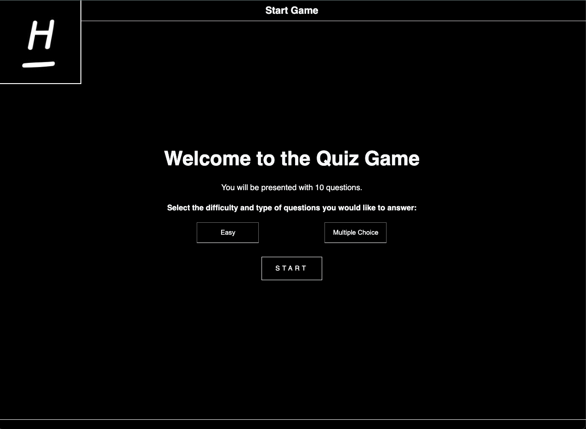
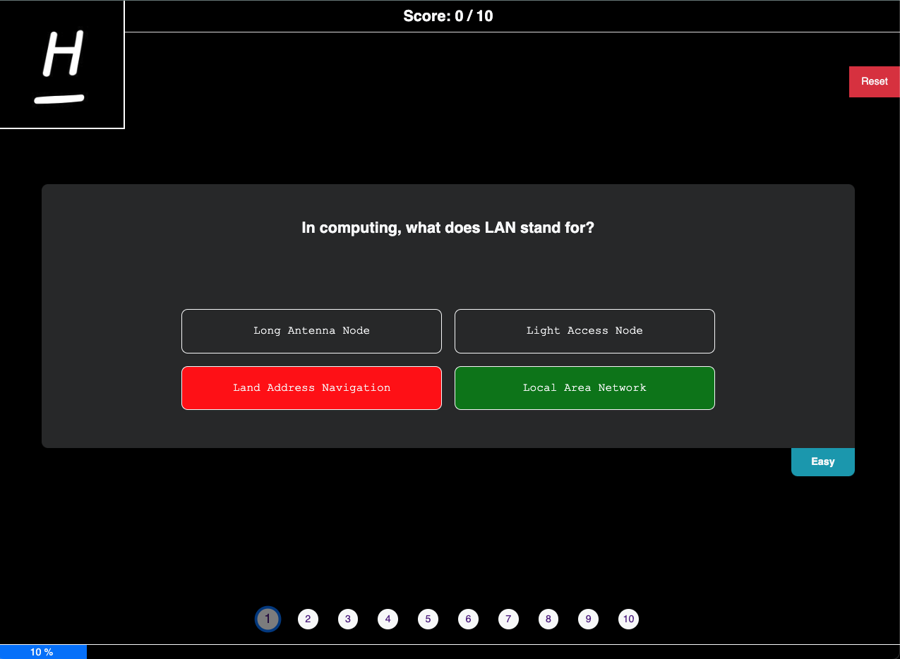
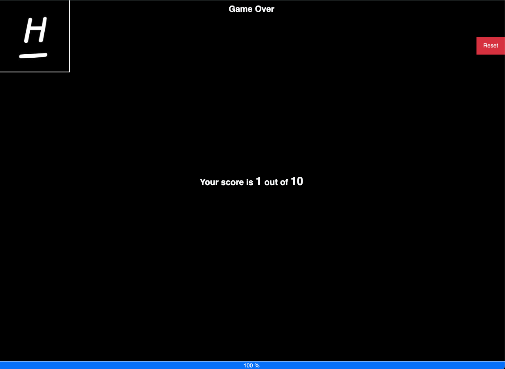

<a id="readme-top"></a>

<br />
<div align="center">
    
  
  <h3 align="center">✨Quiz Game✨</h3>

  <p align="center">
	Tech assignment for the role of Fullstack Developer at Homerun
  </p>
</div>

<hr/>

<!-- TABLE OF CONTENTS -->

<details>
  <summary>Table of Contents</summary>
  <ol>
    <li>
      <a href="#about-the-project">About The Project</a>
      <ul>
         <li><a href="#build-with">Build With</a></li>
    </li>
    <li>
      <a href="#getting-started">Getting Started</a>
      <ul>
        <li><a href="#prerequisites">Prerequisites</a></li>
        <li><a href="#installation">Installation</a></li>
      </ul>
    </li>
    <li><a href="#usage">Usage</a></li>
    <li><a href="#license">License</a></li>
    <li><a href="#contact">Contact</a></li>
    <li><a href="#acknowledgments">Acknowledgments</a></li>
  </ol>
</details>

<!-- ABOUT THE PROJECT -->

## About The Project



This is a simple but modern UI for the Quiz Game. The app is built using ReactJs.

- Modern UI with a responsive design.
- Display Quiz questions with multiple options.
- User can select the answer and move to the next question.
- User can see their live score.
- User can reset the quiz and start again.
- You have only one chance to select the answer.
- You will get the result after you finish the quiz.

<p align="right">(<a href="#readme-top">back to top</a>)</p>

## Build With ️

- [ReactJs](https://reactjs.org/)
- [css](https://developer.mozilla.org/en-US/docs/Web/CSS)
- [Axios](https://axios-http.com/)

<p align="right">(<a href="#readme-top">back to top</a>)</p>

<!-- GETTING STARTED -->

## Getting Started

### Prerequisites

You need to have the following installed on your machine:

- node

  ```sh
  node --version
  ```

- npm
  ```sh
  npm install npm@latest -g
  ```

### Installation

This app is built using NextJs, so you need to have NodeJs installed on your machine. Here's how you can get started:

1. Clone the repo
   ```sh
   https://github.com/Tenzijn/quiz-homerun.git
   ```
2. Install NPM packages
   ```sh
   npm install
   ```
3. Run the app
   ```sh
    npm run dev
   ```
4. Open the app in your browser
   ```sh
    http://localhost:5173/
   ```

<p align="right">(<a href="#readme-top">back to top</a>)</p>

<!-- LICENSE -->

## License

Distributed under the MIT License. You can use this without any restrictions.

<p align="right">(<a href="#readme-top">back to top</a>)</p>

<!-- CONTACT -->

## Contact

Tenzin Kunchok - tenzinkunchok2022@gmail.com

<p align="right">(<a href="#readme-top">back to top</a>)</p>

<!-- ACKNOWLEDGMENTS -->

## More Images





## Acknowledgments

- [API - opentdb.com](https://opentdb.com/api_config.php)

<p align="right">(<a href="#readme-top">back to top</a>)</p>
